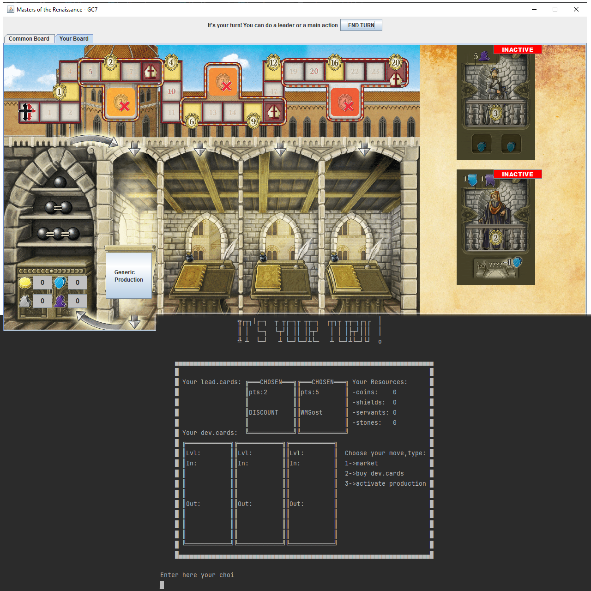
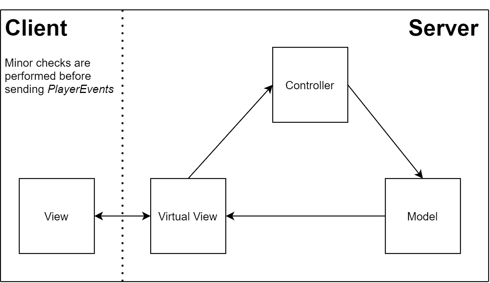
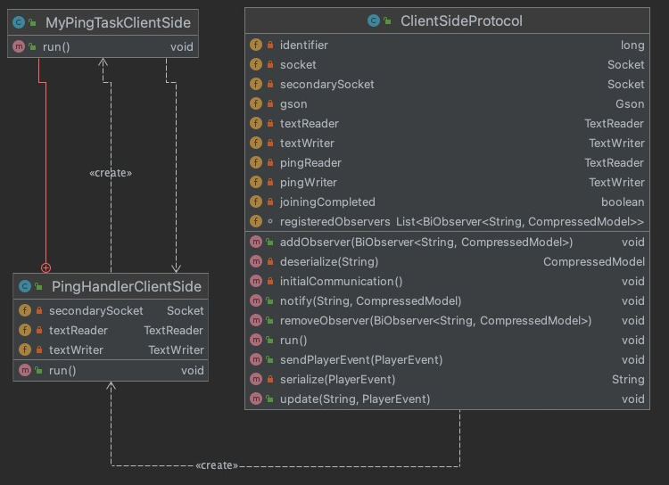
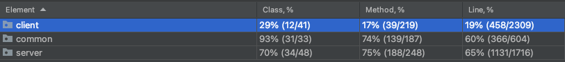
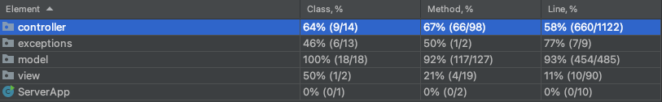
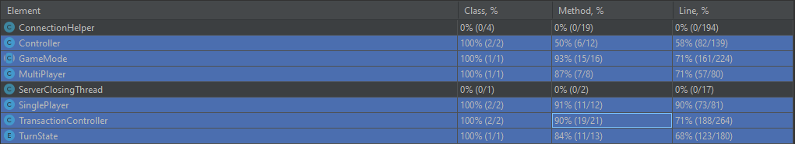
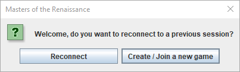

# Prova Finale Ing. del Software 2020/2021 - GC07
The project is a Java implementation of *Cranio Creations*' tabletop game "Masters of Renaissance". It was done as a final assignment for the Software Engineering I course at Politecnico di Milano.

## Development Team (GC07)

- Elisa Mariani (10632876)
- Francesco Panebianco (10632465)
- Vincenzo Pecorella (10607529)

## Project Requirements
The following project requirements have been selected from the exam evaluation grid:

- **Full Rule Set**: Both Multiplayer and Singleplayer modes have been
  implemented.
- **CLI + GUI** : The implementation supports both a Command Line Interface and a Graphical User Interface.
- **Socket** : Both Multiplayer and Singleplayer modes require a server to run. Client and Server communicate through a TCP socket.
- **2 Advanced Features** :
	- *Multiple Game Sessions* : The implementation allows multiple game sessions to run independently at once.
	- *Disconnection Resilience* : A disconnected player can rejoin a game session after disconnection while it is still running, unless all players have disconnected or the session was in SinglePlayer mode.

## Implementation Choices
MVC Pattern Scheme (*Thin Client*)

The GUI implementation uses the *Swing* standard library. Swing was chosen over JavaFX for its simplicity and flexibility on the redefinition of default components (e.g. Dialogs and GameButtons).

Card data is loaded at the start of the game on both Server and Client from a JSON source file. JSON Serialization/Deserialization is also used for Client-Server communication over integrated serialization solutions to facilitate debugging. The **Gson** library from Google Inc. was the obvious choice, as our ad-hoc communication data packets didn't need specific serialization code override.

The connection resilience protocol design required a periodic ping message to be sent in parallel ouside the direct game message channel: to achieve this result, the ping timer logic was associated to a separate Thread and Socket.

Before the game session has started, a simple conventional string protocol is used between Client and Server to request the player Username and, if the player is a game session host, the total number of players.

## Unit Test Coverage
Unit tests cover *all* major model and controller methods. The controller package contains most server-side connection code: because of that, only 58% of the controller package lines were covered.

Zooming in, major controller logic classes were extensively tested.

## Running the game
The *deliverables* folder contains two runnable *.jar* archives:

### GC07-Client.jar
To run the client in **GUI** mode, just double click the jar file and the login screen will appear.

By pressing "Reconnect", the player can attempt to reconnect to a previous game session from which they previously dropped out due to a disconnection or a voluntary interruption. The other button, on the other hand, allows the player to join an existing game session (or create one, if there isn't an available one already). From that moment on, the player will be asked their unique *username* and, if necessary, the number of players that the game session will host. The game window will open as soon as another player connects to the session. The game starts when the session player number is reached.

Please Note: To reconnect to a game session, the player will have to use the same username.

___

To run the client in **CLI** mode, the player has to use the terminal to navigate to the folder containing the jar and type

    java -jar GC07-Client.jar -nogui
or

    java -jar GC07-Client.jar -cli

Instructions to start join or reconnect to a game session will be displayed in the terminal.
___
Additional running arguments may be used to override the sockets' parameters to connect to a server running NAPT bypass utilities such as *ngrok*. In the examples below, "OVERRIDE_VALUE" is the value the player whishes to use.

- Main Port (50000 by default) `-port1:OVERRIDE_VALUE`

- Ping Port (50001 by default) `-port2:OVERRIDE_VALUE`

- Ping Ip Address (same as main server ip by default)  `-ipPing:OVERRIDE_VALUE`

### GC07-Server.jar
To run the server executable, the domain host will simply have to type

    java -jar GC07-Server.jar

For extra convenience, the deliverables folder has been provided with a .bat file for easier execution on Windows platforms

**WARNING!** Do not run the JAR directly by double click or you will have to force close the JVM process.

#### Shutting down the server
To correctly close the server from the terminal, just type QUIT (case is ignored).

___
Additional running arguments can override the main and/or ping socket ports, no differently than how the override is performed on the Client's side

- Main Port (50000 by default) `-port1:OVERRIDE_VALUE`

- Ping Port (50001 by default) `-port2:OVERRIDE_VALUE`

## Tools

- [IntelliJ Idea](https://www.jetbrains.com/idea/) by JetBrains - IDE
- [Maven](https://maven.apache.org/) - Dependency Management
- [Visual Paradigm Online](https://online.visual-paradigm.com/) - UML Editor
- [JUnit5](https://junit.org/junit5/) - Unit Test Handler
